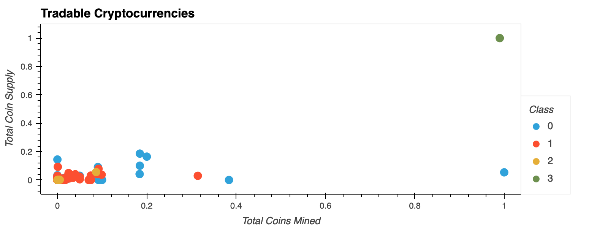

# Crypto Clustering

The main purpose of this analysis is to identify the cryptocurrencies which are on the trading market. The cryptocurrencies will be clustered using the KMeans algorithm, and visualized using plotly and Pandas' hvplot. 

## Keywords:
- *pandas*
- *PCA* 
- *KMeans* 
- *hvplot*

## Result
The scatter plot below shows the main result of this clustering where the tradable cryptocurrencies are grouped into four clusters. 

